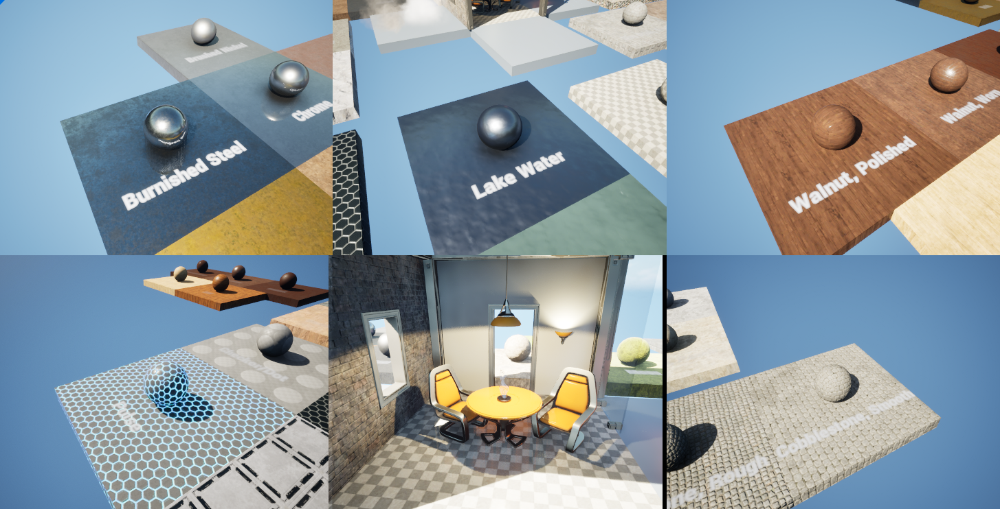
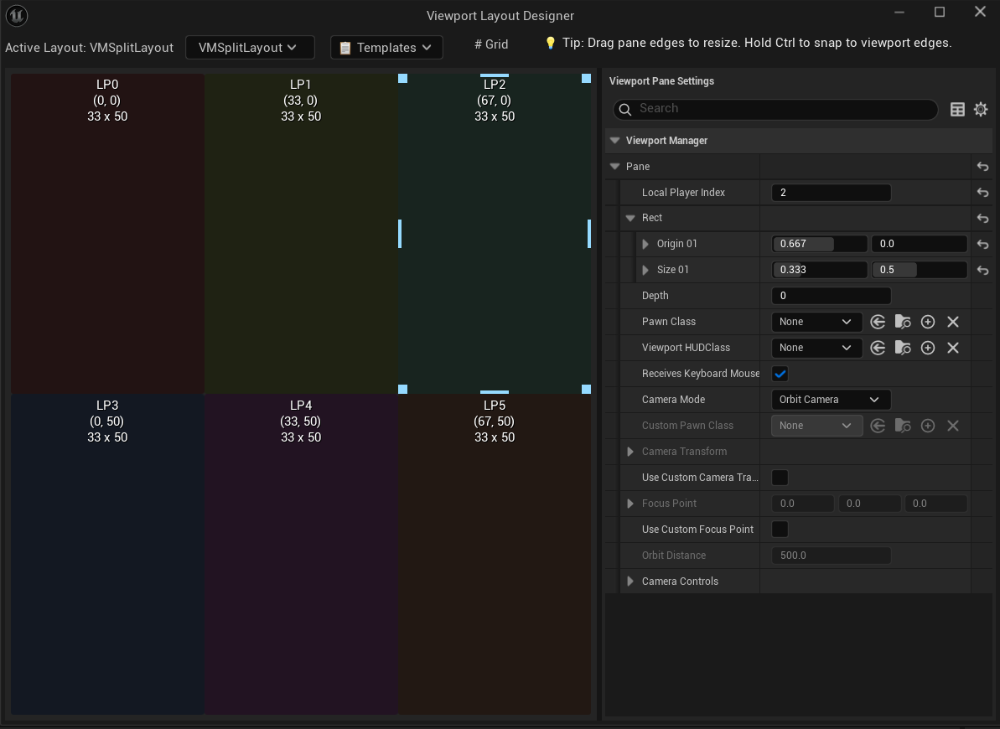
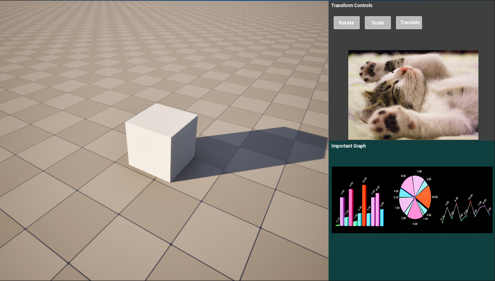

# Viewport Manager

<div align="center">


**Professional viewport management system for Unreal Engine 5.7+**

[Features](#features) • [Installation](#installation) • [Quick Start](#quick-start) • [Documentation](#documentation) • [API Reference](#api-reference)

  <table>
    <tr>
      <td></td>
      <td></td>
      <td></td>
    </tr>
    <tr>
      <td align="center"><b>More than 4 viewports!</b><br/>Have as many as you desire</td>
      <td align="center"><b>Custom Layout</b><br/>Unique Configuration</td>
      <td align="center"><b>Widget Supported</b><br/>Create widget only viewports</td>
    </tr>
  </table>

</div>

<br>

## Table of Contents

- [Overview](#overview)
- [Features](#features)
- [Requirements](#requirements)
- [Installation](#installation)
- [Quick Start](#quick-start)
- [Core Concepts](#core-concepts)
- [Camera Pawns](#camera-pawns)
- [Layout System](#layout-system)
- [Configuration](#configuration)
- [API Reference](#api-reference)
- [Troubleshooting](#troubleshooting)
- [Contributing](#contributing)
- [License](#license)

<br>

## Overview

Are you tired of being limited by the native 4-player split screen in Unreal Engine? Do you wish you could customize them freely and have more of them? This plugin is for you! <br><br>
**Viewport Manager** is a powerful C++ plugin for Unreal Engine 5.7+ that enables advanced viewport management beyond the engine's default 4-player limit. Create custom viewport layouts, manage multiple camera views, and build sophisticated multi-pane applications with ease.

**Important:** This plugin requires the **EnhancedInput plugin** to be enabled in your project.

<br>

## Features

### Viewport Management
- Support for up to **32 simultaneous viewports! Or more??**
- **Custom viewport layouts** with pixel-perfect positioning
- **Runtime layout switching** without restart
- **Per-viewport HUD** support with proper clipping
- **Click-to-focus** input routing
- **Focus highlighting** for active viewport

### Camera System
- **VMCameraPawn** - Professional orbit camera with spring arm
  - Target tracking
  - Smooth transitions
  - Configurable zoom (distance, FOV, orthographic)
  - Pan and orbit controls
  - Focus point management

- **VMFreeCameraPawn** - Free-flying camera
  - WASD movement
  - Mouse look
  - Sprint mode
  - Camera-relative movement

### Editor Tools
- **Layout Designer** - Visual layout creation tool
- **Quick Start Wizard** - Automated setup with validation
- **Input Setup Tool** - One-click camera input configuration
- **Project Settings** - Centralized configuration panel

### Developer Experience
- **Full Blueprint API** - Access all features from Blueprints
- **C++ API** - Complete source code access
- **Validation system** - Real-time configuration checks
- **Auto-configuration** - Intelligent project setup

<br>

## Requirements

- **Unreal Engine**: 5.7 or later
- **Platform**: Windows
- **Build Tools**: Visual Studio 2022 (Windows) or compatible C++ compiler
- **Project Type**: C++ or Blueprint (plugin works with both)
- **Dependencies**: **EnhancedInput plugin** (must be enabled in your project)

<br>

## Installation

### Method 1: Fab Marketplace
1. Navigate to the [Fab Marketplace listing]([https://www.fab.com/listings/5f860e1e-b4f5-4c08-8a72-ffb0baf05263](https://www.fab.com/listings/6bc8b467-2ef5-4848-8c26-170893b0998c?tab=%3Ar1e%3A))
2. Install through Fab marketplace

### Method 2: Plugin Installation

1. **Download/Clone** the ViewportManager plugin
2. **Copy** the `ViewportManager` folder to your project's `Plugins` directory:
   ```
   YourProject/
   └── Plugins/
       └── ViewportManager/
   ```
3. **Regenerate** project files (right-click `.uproject` → Generate Visual Studio project files)
4. **Compile** your project
5. **Enable** the plugin in Edit → Plugins → Installed → Viewport Manager
6. **Enable** the EnhancedInput plugin (required dependency)

<br>

## Quick Start

### Automated Setup

1. **Open Quick Start Wizard**
   ```
   Window → Viewport Manager → Quick Start Wizard
   ```

2. **Click "Fix All Issues"**

   The wizard automatically configures:
   - Game Viewport Client
   - Game Instance
   - Game Mode
   - Camera Input Mappings
   - Max Splitscreen Players

3. **Press Play** - Your viewports are ready!

### Manual Setup

If you prefer manual configuration:

#### 1. Configure DefaultEngine.ini

```ini
[/Script/Engine.Engine]
GameViewportClientClassName=/Script/ViewportManager.VMGameViewportClient

[/Script/EngineSettings.GameMapsSettings]
GameInstanceClass=/Script/ViewportManager.VMGameInstance
GlobalDefaultGameMode=/Script/ViewportManager.VMSplitGameMode

[/Script/Engine.GameViewportClient]
MaxSplitscreenPlayers=32
```

#### 2. Setup Camera Input

```
Window → Viewport Manager → Setup Camera Input
```

Or manually add to `DefaultInput.ini`:

```ini
[/Script/Engine.PlayerInput]
+AxisMappings=(AxisName="MoveForward",Scale=1.0,Key=W)
+AxisMappings=(AxisName="MoveForward",Scale=-1.0,Key=S)
+AxisMappings=(AxisName="MoveRight",Scale=1.0,Key=D)
+AxisMappings=(AxisName="MoveRight",Scale=-1.0,Key=A)
+AxisMappings=(AxisName="Turn",Scale=1.0,Key=MouseX)
+AxisMappings=(AxisName="LookUp",Scale=-1.0,Key=MouseY)

+ActionMappings=(ActionName="RightMouseButton",Key=RightMouseButton)
+ActionMappings=(ActionName="LeftShift",Key=LeftShift)
```

#### 3. Create a Layout

Use the Layout Designer:
```
Window → Viewport Manager → Layout Designer
```

Or create programmatically in Blueprint/C++.

<br>

## Core Concepts

### Layout Assets

Layouts define viewport configurations. Each layout contains:

- **Panes**: Individual viewport definitions
- **Rect**: Position and size (normalized 0-1 coordinates)
- **Pawn Class**: Camera type for the pane
- **HUD Class**: Optional UI widget for the pane
- **Camera Settings**: Per-pane camera configuration

### Coordinate System

Viewports use **normalized coordinates** (0.0 to 1.0):

```cpp
// Example: Left half of screen
FVMSplitPane LeftPane;
LeftPane.Rect.Origin = FVector2f(0.0f, 0.0f);   // Top-left
LeftPane.Rect.Size = FVector2f(0.5f, 1.0f);     // 50% width, 100% height
```

### Input Routing

- **Mouse/Keyboard**: Routes to viewport under cursor (hover-based)
- **Click-to-Focus**: Optional focus change on viewport click
- **Gamepad**: Routes to active player controller

<br>

## Camera Pawns

### VMCameraPawn (Orbit Camera)

Professional orbit camera for viewing objects:

```cpp
// Blueprint Example
UVMSplitBlueprintLibrary::FocusOnActor(
    0,                          // LocalPlayerIndex
    TargetActor,                // Actor to focus
    800.0f,                     // Distance
    true                        // Enable tracking
);
```

**Features:**
- Spring arm rotation
- Configurable orbit distance
- Mouse button controls (Right: orbit, Middle: pan)
- Zoom with mouse wheel
- Target tracking
- Focus point management

**Default Controls:**
- **Right Mouse Button + Drag**: Orbit around focus point
- **Middle Mouse Button + Drag**: Pan camera
- **Mouse Wheel**: Zoom in/out
- **Left Mouse Button**: Set focus point (raycast)

### VMFreeCameraPawn (Free Camera)

Free-flying camera for navigation:

```cpp
// Blueprint Example
UVMSplitBlueprintLibrary::SetCameraControlsEnabled(
    0,                          // LocalPlayerIndex
    true,                       // Enable controls
    true,                       // Enable pan
    true                        // Enable orbit
);
```

**Features:**
- Camera-relative WASD movement
- Mouse look
- Sprint mode (Shift)
- Adjustable movement speed

**Default Controls:**
- **W/S**: Move forward/backward
- **A/D**: Strafe left/right
- **Q/E**: Move up/down
- **Mouse**: Look around
- **Shift**: Sprint

<br>

## Layout System

### Creating Layouts in Blueprint

```cpp
// Create a 2-viewport vertical split
bool Success = UVMSplitBlueprintLibrary::QuickSetupSplitScreen(
    2,                          // NumPlayers
    false,                      // bHorizontalSplit (false = vertical)
    UMyHUDWidget::StaticClass() // Optional HUD class
);
```

### Creating Layouts in C++

```cpp
// Create layout asset
UVMSplitLayoutAsset* Layout = NewObject<UVMSplitLayoutAsset>();

// Configure first pane (top half)
FVMSplitPane TopPane;
TopPane.Rect.Origin = FVector2f(0.0f, 0.0f);
TopPane.Rect.Size = FVector2f(1.0f, 0.5f);
TopPane.PawnClass = AVMCameraPawn::StaticClass();
Layout->Panes.Add(TopPane);

// Configure second pane (bottom half)
FVMSplitPane BottomPane;
BottomPane.Rect.Origin = FVector2f(0.0f, 0.5f);
BottomPane.Rect.Size = FVector2f(1.0f, 0.5f);
BottomPane.PawnClass = AVMFreeCameraPawn::StaticClass();
Layout->Panes.Add(BottomPane);

// Apply layout
UVMSplitSubsystem* Subsystem = GetWorld()->GetGameInstance()
    ->GetSubsystem<UVMSplitSubsystem>();
Subsystem->ApplyLayout(Layout);
```

### Layout Designer (Editor Tool)

Visual layout creation tool:

1. **Open**: `Window → Viewport Manager → Layout Designer`
2. **Add Panes**: Click "Add Pane" to create viewports
3. **Configure**: Set position, size, and camera type
4. **Save**: Save as `.uasset` layout file
5. **Apply**: Reference in subsystem or use AVMAutoLayoutActor

<br>

## Configuration

### Project Settings

Access via: `Edit → Project Settings → Plugins → Viewport Manager`

**Available Settings:**
- Default layout asset
- Auto-create players on layout load
- Default camera pawn classes
- Input configuration

### Camera Control Settings

Configure per-pane camera behavior:

```cpp
FVMCameraControlSettings Settings;
Settings.bCameraControlsEnabled = true;
Settings.bOrbitEnabled = true;
Settings.bPanEnabled = true;
Settings.OrbitSensitivity = 1.0f;
Settings.PanSpeedScalar = 1.0f;
Settings.bKeepMouseCursorVisible = true;

// Apply to pawn
if (AVMCameraPawn* CameraPawn = Cast<AVMCameraPawn>(GetPawn()))
{
    CameraPawn->ApplyControlSettings(Settings);
}
```

<br>

## API Reference

### UVMSplitSubsystem

Game instance subsystem for viewport management.

```cpp
// Get subsystem
UVMSplitSubsystem* Subsystem = GetWorld()->GetGameInstance()
    ->GetSubsystem<UVMSplitSubsystem>();

// Apply layout
void ApplyLayout(UVMSplitLayoutAsset* Layout);

// Modify pane
void SetPaneRect(int32 LocalPlayerIndex, float OriginX, float OriginY,
                 float SizeX, float SizeY);
void SetPanePawnClass(int32 LocalPlayerIndex, TSubclassOf<APawn> PawnClass);

// Input routing
void SetActiveKeyboardMousePlayer(int32 LocalPlayerIndex);
int32 GetActiveKeyboardMousePlayer() const;

// Query
int32 GetLocalPlayerCount() const;
APlayerController* GetPlayerController(int32 LocalPlayerIndex) const;
```

### UVMSplitBlueprintLibrary

Blueprint function library for common operations.

```cpp
// Quick setup
static bool QuickSetupSplitScreen(int32 NumPlayers, bool bHorizontalSplit,
                                   TSubclassOf<UUserWidget> HUDClass);

// Camera focus
static void FocusOnActor(int32 LocalPlayerIndex, AActor* TargetActor,
                         float Distance, bool bEnableTracking);

// Camera controls
static void SetCameraControlsEnabled(int32 LocalPlayerIndex, bool bEnabled,
                                     bool bPanEnabled, bool bOrbitEnabled);

// Reset camera
static void ResetCameraToStartPosition(int32 LocalPlayerIndex);
```

### UVMGameViewportClient

Custom viewport client managing layout rendering.

```cpp
// Apply layout
void ApplyLayout(UVMSplitLayoutAsset* LayoutAsset);

// Refresh layout
void RefreshLayout();

// Input management
void SetActiveLocalPlayer(int32 LocalPlayerIndex);
int32 GetActiveLocalPlayer() const;

// Click-to-focus
void SetClickToFocusEnabled(bool bEnabled);
bool IsClickToFocusEnabled() const;
```

### AVMCameraPawn

Orbit camera pawn.

```cpp
// Focus management
void SetFocusPoint(const FVector& NewFocusPoint);
void SetTargetActor(AActor* NewTargetActor);
void FocusOnActor(AActor* Actor, float Distance, bool bEnableTracking);

// Camera projection
void SetProjectionMode(EVMProjectionMode Mode);
void SetFieldOfView(float NewFOV);
void SetOrthoWidth(float NewWidth);

// Controls
void SetCameraControlsEnabled(bool bEnabled);
void SetOrbitEnabled(bool bEnabled);
void SetPanEnabled(bool bEnabled);
void ApplyControlSettings(const FVMCameraControlSettings& Settings);
```

### AVMFreeCameraPawn

Free-flying camera pawn.

```cpp
// Movement speed
void SetMoveSpeed(float NewSpeed);
void SetSprintSpeed(float NewSpeed);

// Look sensitivity
void SetLookSensitivity(float NewSensitivity);

// Apply settings
void ApplyControlSettings(const FVMCameraControlSettings& Settings);
```

<br>

## Usage Examples

### Example 1: Security Camera System

```cpp
// Create 4-viewport grid layout
UVMSplitBlueprintLibrary::QuickSetupSplitScreen(4, true);

// Focus each viewport on a different camera
TArray<AActor*> SecurityCameras = GetSecurityCameras();
for (int32 i = 0; i < 4 && i < SecurityCameras.Num(); i++)
{
    UVMSplitBlueprintLibrary::FocusOnActor(i, SecurityCameras[i], 500.0f, true);
}
```

### Example 2: Picture-in-Picture

```cpp
UVMSplitLayoutAsset* Layout = NewObject<UVMSplitLayoutAsset>();

// Main viewport (full screen)
FVMSplitPane MainPane;
MainPane.Rect = FVMSplitRect(FVector2f(0.0f, 0.0f), FVector2f(1.0f, 1.0f));
MainPane.PawnClass = AVMCameraPawn::StaticClass();
Layout->Panes.Add(MainPane);

// Picture-in-picture (bottom-right corner, 25% size)
FVMSplitPane PIPPane;
PIPPane.Rect = FVMSplitRect(FVector2f(0.75f, 0.75f), FVector2f(0.25f, 0.25f));
PIPPane.PawnClass = AVMFreeCameraPawn::StaticClass();
Layout->Panes.Add(PIPPane);

// Apply
UVMSplitSubsystem* Subsystem = GetWorld()->GetGameInstance()
    ->GetSubsystem<UVMSplitSubsystem>();
Subsystem->ApplyLayout(Layout);
```

### Example 3: Runtime Layout Switching

```cpp
// Switch between different layout presets
void ASwitchLayoutActor::SwitchToLayout(UVMSplitLayoutAsset* NewLayout)
{
    UVMSplitSubsystem* Subsystem = GetWorld()->GetGameInstance()
        ->GetSubsystem<UVMSplitSubsystem>();

    if (Subsystem && NewLayout)
    {
        Subsystem->ApplyLayout(NewLayout);
    }
}
```

<br>

## Troubleshooting

<details>
<summary><strong>Camera Not Responding to Input</strong></summary>

**Symptoms:** Camera doesn't move when pressing keys or moving mouse

**Solutions:**
1. Run Quick Start Wizard: `Window → Viewport Manager → Quick Start Wizard`
2. Click "Fix Camera Input" to configure input mappings
3. Verify input bindings in `Project Settings → Input`
</details>

<details>
<summary><strong>Viewports Not Appearing</strong></summary>

**Symptoms:** Black screen or single viewport instead of layout

**Solutions:**
1. Verify `GameViewportClientClassName` is set in DefaultEngine.ini:
   ```ini
   [/Script/Engine.Engine]
   GameViewportClientClassName=/Script/ViewportManager.VMGameViewportClient
   ```
2. Check `GameInstanceClass` is configured:
   ```ini
   [/Script/EngineSettings.GameMapsSettings]
   GameInstanceClass=/Script/ViewportManager.VMGameInstance
   ```
3. Ensure `MaxSplitscreenPlayers=32` is set
</details>

<details>
<summary><strong>Input Not Routing to Correct Viewport</strong></summary>

**Symptoms:** Mouse/keyboard input goes to wrong viewport

**Solutions:**
1. Enable click-to-focus in viewport client settings
2. Verify hover-based input routing is enabled
3. Check that cursor visibility is enabled:
   ```cpp
   PlayerController->bShowMouseCursor = true;
   PlayerController->SetInputMode(FInputModeGameAndUI());
   ```
</details>

<details>
<summary><strong>HUD Not Displaying</strong></summary>

**Symptoms:** HUD widget not visible in viewport

**Solutions:**
1. Verify HUD class is assigned to pane in layout
2. Check widget visibility and Z-order
3. Ensure VMHUDRootWidget is being used as base class
4. Verify proper canvas panel setup in HUD widget
</details>

<details>
<summary><strong>Layout Not Persisting</strong></summary>

**Symptoms:** Layout resets on editor restart

**Solutions:**
1. Save layout as `.uasset` file in Content Browser
2. Set default layout in Project Settings
3. Use AVMAutoLayoutActor to auto-apply layout on BeginPlay
</details>

<br>

## Contributing

Contributions are welcome! To contribute:

- **Bug Reports**: Use GitHub Issues with UE version, reproduction steps, and logs
- **Pull Requests**: Fork, create feature branch, commit, and submit PR
- **Code Style**: Follow Unreal Engine C++ standards with meaningful names and focused functions

<br>

## License

**Viewport Manager** is **free to use and modify** for your projects.

### Terms

- Free to use in personal and commercial projects
- Free to modify and customize for your needs
- Cannot be resold for profit without explicit permission from me

If you wish to redistribute or sell this plugin (modified or unmodified), please contact me for permission.
jackcayc924@gmail.com

<br>

## Support

- **Issues**: [GitHub Issues](https://github.com/jackcayc924/ViewportManager/issues)
- **Discussions**: [GitHub Discussions](https://github.com/jackcayc924/ViewportManager/discussions)

<br>

<div align="center">


[Back to Top](#viewport-manager)

</div>
